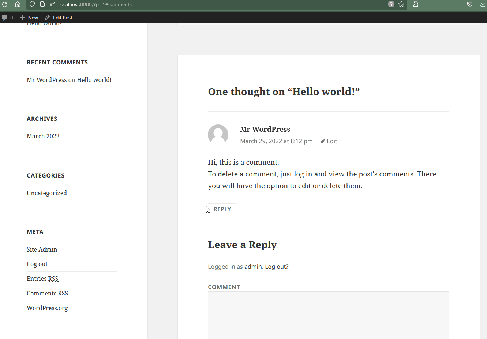

# Project 7 - WordPress Pentesting

> Time spent: 5+ hours spent in total

> Objective: Find, analyze, recreate, and document **three to five vulnerabilities** affecting an old version of WordPress

## Test Environment

Created virtual environment in Docker.
  - [ ] GIF Walkthrough: 
		
		
## Pentesting Report

### 1. WordPress <= 4.5.1 - Pupload Same Origin Method Execution (SOME) - CVE-2016-4566
  - [ ] Summary: 
    - Vulnerability types: Cross-Site Scripting (XSS)
    - Tested in version: 4.1
    - Fixed in version: 4.1.11 
  - [ ] GIF Walkthrough: 
		
		
  - [ ] Steps to recreate: 
  
	1. As a logged in user, leaving a reply/comment to a post using the payload:
			
	2.		
			
			<button onclick="fire()">Click</button>
				
			
	3. After this comment posts sucessfully, any user that comes across the post will see a clickable button within the comment. If that user clicks the button, the XSS attack will execute and attempt to download a malicious payload from the attack. 
			
	4. In the gif walkthrough, my browser extentions sucessfully blocks the attack from downloading the file, but a user without the proper safeguards would be prompted to download a file. 
			
  - [ ] References:
    - [Link 1: wpscan](https://wpscan.com/vulnerability/a82a6c6f-1787-4adc-84dd-3151f1edfd06)
	- [Link 2: cve.mitre](https://cve.mitre.org/cgi-bin/cvename.cgi?name=CVE-2016-4566)
	- [Link 3: wordpress.org](https://wordpress.org/news/2016/05/wordpress-4-5-2/)
	- [Link 4: github/wordpress](https://github.com/WordPress/WordPress/commit/c33e975f46a18f5ad611cf7e7c24398948cecef8)
	- [Link 5: gist.github](https://gist.github.com/cure53/09a81530a44f6b8173f545accc9ed07e)
### 2. WordPress <= 4.2.2 - Authenticated Stored Cross-Site Scripting (XSS)
  - [ ] Summary: 
    - Vulnerability types: XSS
    - Tested in version: 4.1
    - Fixed in version: 4.1.6
  - [ ] GIF Walkthrough: 
		
  - [ ] Steps to recreate: 
	
	1. As a logged in user, leaving a reply/comment to a post using the payload:
			
	2.		
			
			<a href='/wp-admin/' title="XSS" style="position:absolute;top:0;left:0;width:100%;height:100%;display:block;" onmouseover=alert(2)//'Hello World</a>	
			
	3. After this comment posts sucessfully, any user that comes to the page and mouses over the area will see an alert box demonstrating the xss attack. The alert box will keep popping up everytime the area is hover overed with the mouse cursor. 
  
  - [ ] References:
    - [Link 1: wpscan](https://wpscan.com/vulnerability/0f027d7d-674b-4a63-9603-25ea68069c1d)
	- [Link 2: cve.mitre - 2015-5622](https://cve.mitre.org/cgi-bin/cvename.cgi?name=CVE-2015-5622)
	- [Link 3: cve.mitre - 2015-5623](https://cve.mitre.org/cgi-bin/cvename.cgi?name=CVE-2015-5623)
	- [Link 4: wordpress](https://wordpress.org/news/2015/07/wordpress-4-2-3/)
	- [Link 5: twitter](https://twitter.com/klikkioy/status/624264122570526720)
	- [Link 6: klikki](https://klikki.fi/adv/wordpress3.html)
### 3. (Required) Vulnerability Name or ID
  - [ ] Summary: 
    - Vulnerability types:
    - Tested in version:
    - Fixed in version: 
  - [ ] GIF Walkthrough: 
  - [ ] Steps to recreate: 
  - [ ] Affected source code:
    - [Link 1](https://core.trac.wordpress.org/browser/tags/version/src/source_file.php)

## Resources

- [WordPress Source Browser](https://core.trac.wordpress.org/browser/)
- [WordPress Developer Reference](https://developer.wordpress.org/reference/)
- [wpVSkali](https://github.com/0xrutvij/wpVSkali)

GIFs created with [ScreenToGif](https://www.screentogif.com).

## Notes

- Other notes:

## License

Licensed under the Apache License, Version 2.0 (the "License");
you may not use this file except in compliance with the License.
You may obtain a copy of the License at

http://www.apache.org/licenses/LICENSE-2.0

Unless required by applicable law or agreed to in writing, software
distributed under the License is distributed on an "AS IS" BASIS,
WITHOUT WARRANTIES OR CONDITIONS OF ANY KIND, either express or implied.
See the License for the specific language governing permissions and
limitations under the License.
