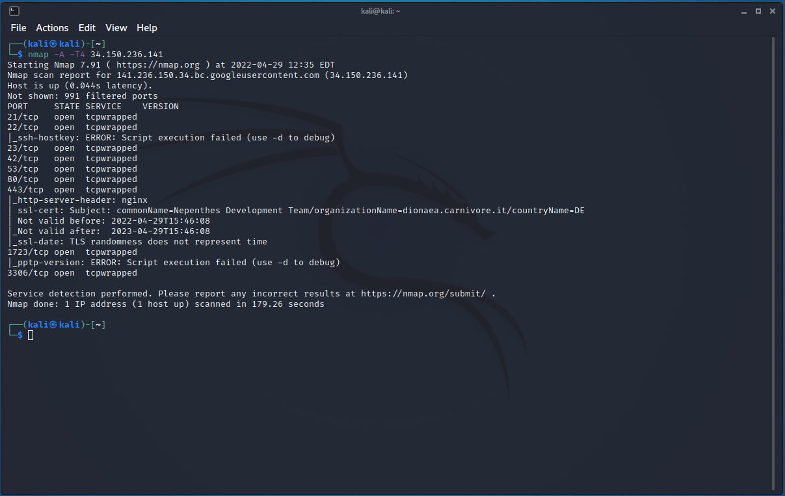

# Honeypot Assignment

**Time spent:** **X** hours

**Objective:** Create a honeynet using MHN-Admin. Present your findings as if you were requested to give a brief report of the current state of Internet security. Assume that your audience is a current employer who is questioning why the company should allocate anymore resources to the IT security team.

### MHN-Admin Deployment (Required)

**Summary:** How did you deploy it? Did you use GCP, AWS, Azure, Vagrant, VirtualBox, etc.?
- Deployed mhn-admin virtual machine using Google Cloud Platform. 
  - Ubuntu 18.04 Minimal
  - HTTP Traffic Allowed (Port 80)
  - TCP Ports 3000 & 10000 open to allow incoming traffic for geolocation and honeypot sensor data
- Google Cloud default region and zone:
```bash
gcloud config set compute/region us-east4

gcloud config set compute/zone us-east4-c
```
- Google Cloud firewall rules:
```bash
gcloud compute firewall-rules list

gcloud compute firewall-rules create http \
    --allow tcp:80 \
    --description="Allow HTTP from Anywhere" \
    --direction ingress \
    --target-tags="mhn-admin"

gcloud compute firewall-rules create honeymap \
    --allow tcp:3000 \
    --description="Allow HoneyMap Feature from Anywhere" \
    --direction ingress \
    --target-tags="mhn-admin"

gcloud compute firewall-rules create hpfeeds \
    --allow tcp:10000 \
    --description="Allow HPFeeds from Anywhere" \
    --direction ingress \
    --target-tags="mhn-admin"
```
- Google Cloud VM creation:
```bash
gcloud compute instances create "mhn-admin" \
    --machine-type "n1-standard-1" \
    --subnet "default" \
    --maintenance-policy "MIGRATE" \
    --tags "mhn-admin" \
    --image-family "ubuntu-minimal-1804-lts" \
    --image-project "ubuntu-os-cloud" \
    --boot-disk-size "10" \
    --boot-disk-type "pd-standard" \
    --boot-disk-device-name "mhn-admin"
```
- Establishing SSH connection:
```bash
gcloud compute ssh mhn-admin
```


- Modern Honey Network (MHN) Admin Application:
  - install time about 30 mins
  - updated ubuntu and installed python-magic
```bash
sudo apt update
sudo apt install git python-magic -y
```
  - cloned MHN repo
  - patched and installed python package
```bash
cd /opt/
sudo git clone https://github.com/pwnlandia/mhn.git
cd mhn/

sudo sed -i 's/Flask-SQLAlchemy==2.3.2/Flask-SQLAlchemy==2.5.1/g' server/requirements.txt

sudo ./install.sh
```
```bash
Do you wish to run in Debug mode? y/n: `n`
Superuser email: `any email used to login to admin console`
Superuser password: `choose any password and confirm`
Server base url ["http://#.#.#.#"]: `Enter to accept default value`
Honeymap url ["http://#.#.#.#:3000"]: `Enter to accept default value`
Mail server address ["localhost"]: `Enter to accept default value`
Mail server port [25]: `Enter to accept default value`
Use TLS for email?: y/n `n`
Use SSL for email?: y/n `n`
Mail server username [""]: `Enter to accept default value`
Mail server password [""]: `Enter to accept default value`
Mail default sender [""]: `Enter to accept default value`
Path for log file ["/var/log/mhn/mhn.log"]: `Enter to accept default value`
Would you like to integrate with Splunk? (y/n) `n`
Would you like to install ELK? (y/n) `n`
Would you like to add MHN rules to UFW? (y/n) `n`
```
  - Logged in to Admin console via external IP using credentials established during installation
    - note: no data available - have not deployed any honeypots yet


### Dionaea Honeypot Deployment (Required)

**Summary:** Briefly in your own words, what does dionaea do?

- Dionaea is a honeypot designed to trap malware so that it can be exported and examined by security researchers. It offers various services on exposed ports to the internet that can attract attackers attempting to exploit vulnerabilities. 


- Only after a few minutes we can see data coming into the MHN Admin Console that traffic and attacks are coming into the Dionaea Honey Pot.


- After running an nmap scan of the dionaea honey pot, the following ports were exposed:

| Port Number   | Service                                  |
| :-----------: | ---------------------------------------- |
| 21            | File Transfer Protocol (FTP)             |
| 22            | Secure Shell (SSH)                       |
| 23            | Telnet - unencrypted text                |
| 42            | Windows Internet Naming Service (WINS)   |
| 53            | Domain Name Service (DNS)                |
| 80            | Hypertext Transfer Protocol (HTTP)       |
| 443           | HTTPS                                    |
| 1723          | Point-to-Point Tunneling Protocol (PPTP) |
| 3306          | MySQL Protocol                           |



### Database Backup (Required) 

**Summary:** What is the RDBMS that MHN-Admin uses? What information does the exported JSON file record?

*Be sure to upload session.json directly to this GitHub repo/branch in order to get full credit.*

### Deploying Additional Honeypot(s) (Optional)


#### Snort Honeypot

**Summary:** Snort is an (IPS) Intrusion Prevention System. Perfoms packet logging and real-time traffic analysis.

#### Cowrie Honeypot

**Summary:** Cowrie is an SSH and Telnet honeypot used to log brute force attacks and shell interactions performed by attackers.

#### Shockpot Honeypot

**Summary:** Shockpot is a web app honeypot designed to find attackers attempting to exploit the Bash remote code vulnerability, CVE-2014-6271.

### Malware Capture and Identification (Optional)

#### X Malware

**Summary:** How did you find it? Which honeypot captured it? What does each malware do?

MD5 Hash: *Run `md5sum` on the file and record the hash here.*

SHA1 Hash: *Run `sha1sum` on the file and record the hash here.*


## Notes

Describe any challenges encountered while doing the assignment.
- [Google Cloud Free Trial](https://cloud.google.com/free/)
- [Google Cloud Compute Engine Docs](https://cloud.google.com/compute/docs)
- [Modern Honey Network - MHN Documentation](https://github.com/pwnlandia/mhn)