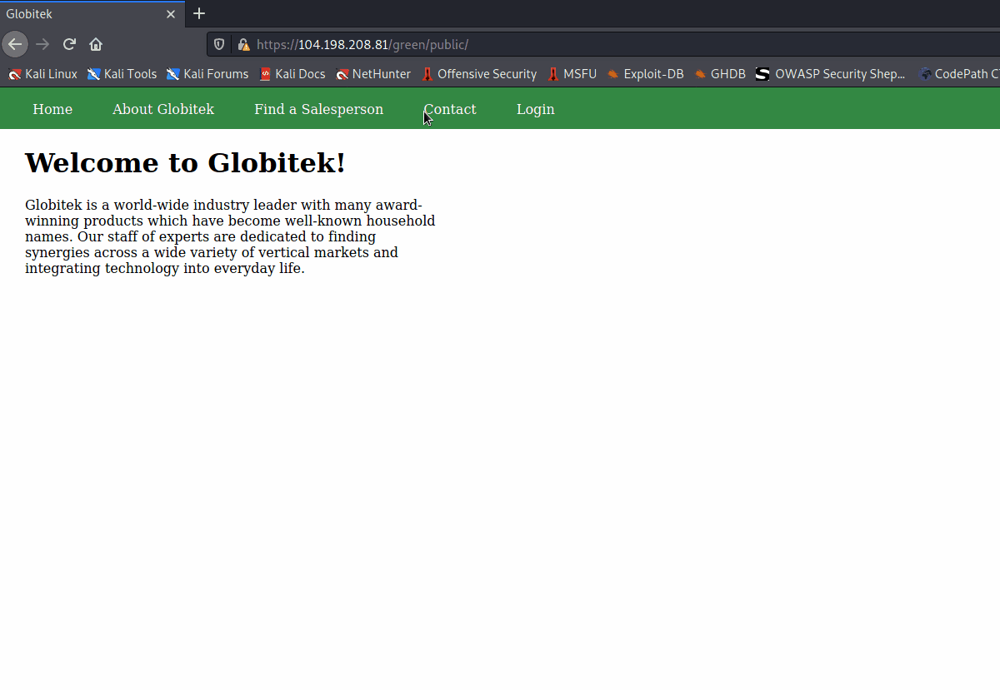

# Project 8 - Pentesting Live Targets

Total time spent: ~**X** hours 

> Objective: Identify vulnerabilities in three different versions of the Globitek website: blue, green, and red.

The six possible exploits are:

* Username Enumeration
* Insecure Direct Object Reference (IDOR)
* SQL Injection (SQLi)
* Cross-Site Scripting (XSS)
* Cross-Site Request Forgery (CSRF)
* Session Hijacking/Fixation

Each color is vulnerable to only 2 of the 6 possible exploits. 1 per color required for full points, additional exploit per color for extra credit. First discover which color has the specific vulnerability, then write a short description of how to exploit it, and finally demonstrate it using screenshots compiled into a GIF.

## Blue

Vulnerability #1: __________________

Description:


Vulnerability #2: __________________

Description:


## Green

Vulnerability #1: Username Enumeration

Description: A malicious user may notice a difference in how a site responds to failed login attempts to provide clues to valid user names. In the attack below, a valid user returns a bold text, and a invalid user returns regular text. When inspecting the source of the returned html, there is a diffeence between:
```
class='failure' vs class='failed'
```
The `failure` class is returned to valid user and the `failed` class is returned to those usernames that do not exist. Setting up burp suite to enumerate through a list of possible user names, an attacker could filter out data of which user names could be valid. In burp, a pitchfork intruder attack was used with two payloads, a recursive grep payload to overcome the csrf tokens when making multiple requests, and a simple list to enumerate through usernames.  


Vulnerability #2: Cross-Site Scripting (XSS)

Description: The Green version of the site is also vulnerable to xss attacks. A user could write a malicious script into the contact form where it is stored until an administrator logs in and views the feedback page. Demonstrated below:




## Red

Vulnerability #1: Insecure Direct Object Reference (IDOR)

Description: The Red version of the Globitek website is vulnerable to IDOR attacks. A malicious user may notice that the URL's can be manipulated. Demonstrated in the attack below, a malicious user may notice the id parameter on the "Find a Salesperson" page where the URL can simply be changed. Without knowing specifically what to look for, an attacker might use a tool like Burp Suite to enumerate through possible id values and see what the site returns back. In this simple case, the attacker sends an http request to the intruder tool, modifies the positions and payloads and starts the attack to enumerate through possible id values of 1-20. The attacker finds an unlisted salesperson under id number 11 and is able to gather private information that the individual was fired for stealing. 


Vulnerability #2: __________________

Description:


## Notes

- [Link: Anti-CSRF Tokens](https://warroom.rsmus.com/updating-anti-csrf-tokens-burp-suite/)
- [Link: Session Handling Rules](https://portswigger.net/support/using-burp-suites-session-handling-rules-with-anti-csrf-tokens)
- [Link: Using Burp Intruder to Test CSRF Protected Applications](https://blog.nvisium.com/p606)